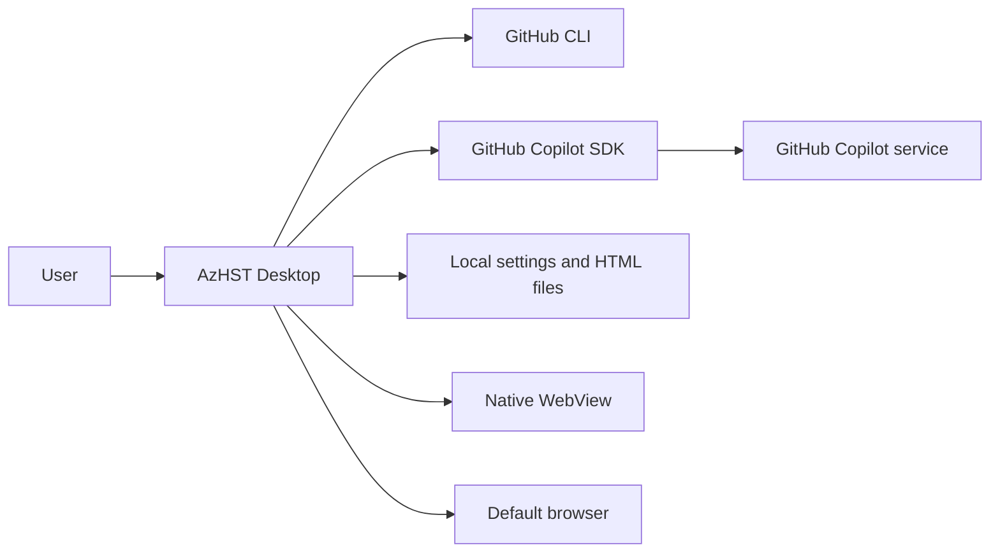
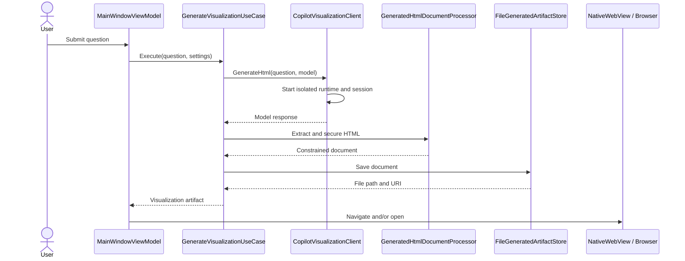

# AzHST architecture

## Goals and first-version scope

AzHST answers Azure and Microsoft services questions with a visual artifact rather than a long chat response. The first version implements one complete request path:

1. Check GitHub CLI authentication.
2. Accept a question and local configuration.
3. Ask GitHub Copilot for one self-contained HTML document.
4. Validate and constrain the generated document.
5. Save it to a user-controlled local directory.
6. Preview it in Avalonia's native WebView and optionally open it externally.

The design keeps model orchestration, operating-system integration, and UI concerns replaceable. The current implementation intentionally does not include conversation persistence, prompt history, Azure API access, retrieval-augmented generation, custom Copilot tools, or deployment packaging.

## System context

The Copilot SDK launches its bundled runtime and communicates with it over JSON-RPC. AzHST uses `CopilotClientMode.Empty`, an explicit empty tool allowlist, no session store, and no host filesystem tools. Copilot returns text to the application; it never writes the generated page directly.

## Solution boundaries

### `AzHST.Application`

The dependency-free application layer contains:

- request and result models
- ports for Copilot, authentication, settings, file output, and browser launch
- `GenerateVisualizationUseCase`, which coordinates one request
- `GeneratedHtmlDocumentProcessor`, which extracts and secures model output

This layer can be tested without Avalonia, GitHub Copilot, GitHub CLI, or a filesystem.

### `AzHST.Infrastructure`

Infrastructure implements the application ports:

- `CopilotVisualizationClient` owns the Copilot client and session lifecycle
- `GitHubCliAuthenticationService` performs a non-interactive `gh` account check
- `JsonSettingsRepository` performs atomic JSON settings writes
- `FileGeneratedArtifactStore` writes unique UTF-8 HTML artifacts
- `ExternalBrowserLauncher` delegates file URIs to the operating system
- `ApplicationPaths` centralizes per-user storage locations

Each generation currently uses a new Copilot session. This keeps lifecycle and failure isolation simple for version one; a future multi-turn chat feature can introduce a scoped session manager without changing the application use case.

### `AzHST.Desktop`

The Avalonia project is the composition root and presentation layer:

- `App` and `ApplicationCompositionRoot` construct concrete services
- view models expose state and asynchronous commands
- views define the desktop shell and settings dialog
- `SettingsDialogService` contains window-specific dialog behavior

No service locator or static global container is used. Constructor dependencies keep ownership explicit.

## Request flow

Progress messages cross the application boundary through `IProgress<GenerationProgress>`. Cancellation is passed into the Copilot request and file write.

## Trust boundaries and safety decisions

### Model output

Generated HTML is treated as untrusted input. The document processor:

- accepts only a complete `<html>`, `<head>`, and `<body>` document
- strips surrounding prose or an HTML Markdown fence
- enforces a 4 MB document limit
- rejects external or active `src` and `href` schemes
- rejects remote CSS `url(...)` resources
- removes `<base>` elements
- replaces any model-provided Content Security Policy
- injects a policy that blocks network connections, frames, forms, objects, navigation bases, and external resources
- blocks WebView navigation away from the generated local file and handles new-window requests

Inline script is allowed because lightweight interaction is a core product requirement. The injected policy still blocks script-initiated network access. A future release can add a stricter HTML parser and an explicit "interactive content" setting.

### Agent capabilities

The Copilot client uses `CopilotClientMode.Empty` and supplies `AvailableTools = []`. It does not expose shell, file, GitHub MCP, custom-agent, skill, or user-elicitation tools. Host custom instructions and ambient Copilot CLI behavior are disabled by the SDK's empty-mode defaults.

### Authentication

GitHub CLI owns interactive sign-in and credential storage. AzHST displays the `gh auth login` command but requires the user to run it in a terminal where all prompts and device codes remain visible. After the user confirms completion, AzHST checks the signed-in username through `gh api user` and asks the Copilot runtime to use the logged-in user. The application never starts the interactive login process and neither reads nor persists a GitHub token.

Debug builds read two test-only environment overrides at the composition root. `TEST_NO_GH_SIGNIN` suppresses only the startup account check, allowing the manual flow to perform a real check after confirmation. `TEST_NO_GH_BIN` makes every check return the normal missing-CLI status without launching a process and takes precedence when both are present. The Release branch is compiled without environment-variable reads and always constructs the production behavior.

### Local files

Settings are written through a temporary file and atomically replaced. Generated file names include UTC time and a random suffix. The configured output path is normalized before use, and persistence failures are surfaced in the UI rather than represented as success.

## Cross-platform WebView strategy

Avalonia's `NativeWebView` uses the platform renderer:

- WebView2 on Windows
- WKWebView on macOS
- WPE WebKit or WebKitGTK on Linux

The application checks the native adapter before creating a WebView. The "Open in browser" action is always available after generation, and AzHST opens the browser automatically when no embedded backend is installed. Packaging should verify and document the native prerequisites for each target distribution.

## Configuration

Version one persists:

| Setting | Default | Purpose |
|---|---|---|
| Model | `auto` | Let Copilot choose an available model |
| Output directory | Local application data under `AzHST\generated` | Store generated pages |
| Open externally | `false` | Also launch each result in the default browser |

Model discovery is deliberately deferred. Free-text model configuration allows testing new Copilot models without releasing a new desktop build, while invalid model errors remain visible.

## Evolution path

Likely next increments:

1. Persist conversations and reuse a scoped Copilot session for follow-up questions.
2. Query the SDK's model catalog and replace free-text model entry with validated selection.
3. Add generation history, delete/export controls, and HTML thumbnails.
4. Intercept WebView navigation and add a configurable script-disabled mode.
5. Introduce curated Azure knowledge retrieval with source metadata and freshness indicators.
6. Add platform packaging, update strategy, telemetry consent, and crash diagnostics.
7. Add UI automation and platform-specific WebView smoke tests in CI.
