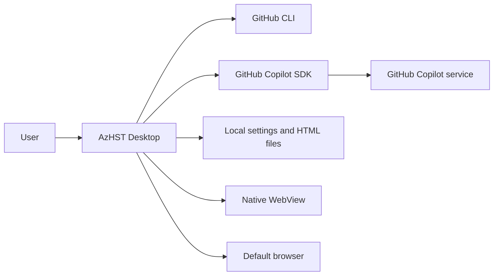

# AzHST architecture

## Goals and first-version scope

AzHST answers Azure and Microsoft services questions with a visual artifact rather than a long chat response. The first version implements one complete request path:

1. Check GitHub CLI authentication.
2. Accept a question and local configuration.
3. Ask GitHub Copilot to classify Azure relevance and visual suitability.
4. Reject invalid requests with actionable guidance.
5. Generate a timestamp-and-slug visualization ID.
6. Ask GitHub Copilot for one self-contained interactive HTML document.
7. Validate and constrain the generated document.
8. Save it as `generated\<id>\index.html`.
9. Preview it in Avalonia's native WebView and optionally open it externally.
10. Optionally extract a bounded structural outline from the secured HTML,
    generate a visual-first slide plan that follows it, and build
    `presentation.pptx` beside the HTML artifact.

The design keeps model orchestration, operating-system integration, and UI concerns replaceable. The current implementation intentionally does not include conversation persistence, prompt history, Azure API access, retrieval-augmented generation, custom Copilot tools, or deployment packaging.

Application startup also validates a local SQLite sample-query catalog. The
home page reads four randomized suggestions from distinct categories. A
complete six-category, ten-query-per-category set is regenerated through
Copilot when its stored timestamp reaches seven days old.

## System context



The Copilot SDK launches its bundled runtime and communicates with it over JSON-RPC. AzHST uses `CopilotClientMode.Empty`, an explicit empty tool allowlist, no session store, and no host filesystem tools. Copilot returns text to the application; it never writes the generated page directly.

## Solution boundaries

### `AzHST.Application`

The dependency-free application layer contains:

- request and result models
- ports for Copilot, authentication, settings, file output, and browser launch
- `GenerateVisualizationUseCase`, which coordinates one request
- `VisualizationArtifactIdGenerator`, which creates timestamp-and-slug IDs
- `GeneratedHtmlDocumentProcessor`, which extracts and secures model output
- `IAzureIconCatalog`, which exposes approved icon metadata and data URIs
- typed output-theme definitions, selected theme settings, and `IOutputThemeCatalog`
- `GeneratePresentationUseCase`, which validates slide plans and coordinates PPTX creation
- `SampleQueryUseCase`, which seeds, validates, refreshes, and randomly selects home-page questions
- `ISampleQueryRepository` and `ICopilotSampleQueryGenerator` ports
- presentation models and ports that contain no Open XML dependency

This layer can be tested without Avalonia, GitHub Copilot, GitHub CLI, or a filesystem.

### `AzHST.Infrastructure`

Infrastructure implements the application ports:

- `CopilotVisualizationClient` owns the Copilot client and session lifecycle
- `FileAzureIconCatalog` validates bundled SVGs, ranks query-relevant icons, and preserves their original bytes as data URIs
- `FileOutputThemeCatalog` strictly loads and validates bundled HTML and presentation theme JSON
- `HtmlPresentationOutlineBuilder` parses secured HTML into a bounded, ordered set of visible headings, labels, table rows, controls, and diagram text for presentation planning
- `OpenXmlPresentationBuilder` creates and validates editable 16:9 PPTX packages
- `GitHubCliAuthenticationService` performs a non-interactive `gh` account check
- `JsonSettingsRepository` performs atomic JSON settings writes
- `SqliteSampleQueryRepository` validates or resets `data\azhst.db`, then performs transactional sample-query replacement and random selection
- `FileGeneratedArtifactStore` atomically writes UTF-8 `index.html` files inside per-artifact directories
- `ExternalBrowserLauncher` delegates file URIs to the operating system
- `ApplicationPaths` centralizes per-user storage locations

Assessment and page generation currently use separate isolated Copilot sessions. This keeps lifecycle and failure isolation simple for version one; a future multi-turn workflow can reuse one client connection without changing the application use case.

### `AzHST.Desktop`

The Avalonia project is the composition root and presentation layer:

- `App` and `ApplicationCompositionRoot` construct concrete services
- view models expose state and asynchronous commands
- views define the desktop shell and tabbed settings/about dialogs
- `SettingsDialogService` contains window-specific dialog behavior
- `AboutDialogService` reads the Desktop assembly's embedded README and release
  notes, then supplies their runtime-rendered HTML to the About window

No service locator or static global container is used. Constructor dependencies keep ownership explicit.

## Request flow

```mermaid
sequenceDiagram
    actor User
    participant VM as MainWindowViewModel
    participant UC as GenerateVisualizationUseCase
    participant PUC as GeneratePresentationUseCase
    participant Copilot as CopilotVisualizationClient
    participant Themes as Output theme catalog
    participant Icons as Azure icon catalog
    participant Policy as GeneratedHtmlDocumentProcessor
    participant PPTX as OpenXmlPresentationBuilder
    participant Store as FileGeneratedArtifactStore
    participant View as NativeWebView / Browser

    User->>VM: Submit question
    VM->>UC: Execute(question, settings)
    UC->>Copilot: AssessQuery(question, model)
    Copilot-->>UC: Validity, message, suggested slug
    alt Invalid request
        UC-->>VM: Actionable validation message
    else Valid request
        UC->>UC: Create hex timestamp + slug ID
        UC->>Themes: Resolve selected HTML theme
        Themes-->>UC: Typed HTML theme
        UC->>Copilot: GenerateHtml(question, model, ID, theme)
        Copilot->>Icons: Find relevant approved icon keys
        Icons-->>Copilot: Small labeled catalog
        Copilot-->>UC: HTML document with optional icon placeholders
        UC->>Policy: Extract, theme, and secure HTML
        Policy->>Icons: Resolve approved placeholders
        Icons-->>Policy: Original SVG data URIs
        Policy-->>UC: Constrained document
        UC->>Store: Save ID/index.html
        Store-->>UC: ID, directory, file path, and URI
        UC-->>VM: Visualization artifact
        VM->>View: Navigate and/or open
        opt Build PowerPoint
            VM->>PUC: Execute(question, visualization, settings)
            PUC->>Copilot: CreatePresentationPlan(question, visualization)
            Copilot->>Copilot: Extract bounded secured-HTML outline
            Copilot-->>PUC: Structured bounded slide plan
            PUC->>Themes: Resolve selected presentation theme
            Themes-->>PUC: Typed presentation theme
            PUC->>PPTX: Build validated plan with theme
            PPTX-->>PUC: presentation.pptx artifact
            PUC-->>VM: PowerPoint artifact
            VM->>View: Show path; copy, reveal, or open presentation
        end
    end
```

Progress messages cross the application boundary through `IProgress<GenerationProgress>`. Cancellation is passed into the Copilot request and file write.

## Trust boundaries and safety decisions

### Model output

Generated HTML is treated as untrusted input. The document processor:

- accepts only a complete `<html>`, `<head>`, and `<body>` document
- strips surrounding prose or an HTML Markdown fence
- enforces a 4 MB document limit
- requires non-empty inline JavaScript and at least one semantic interactive control
- requires CSS or JavaScript motion plus a `prefers-reduced-motion: reduce` fallback
- accepts Azure icons only through known `` catalog keys
- requires descriptive icon alt text and rejects model-supplied icon sources
- replaces each approved placeholder with the original SVG bytes as a base64 `data:` image
- removes model-provided theme markers and injects authoritative CSS variables for the selected HTML theme
- rejects external or active `src` schemes and all external links except
  manifest-matched source anchors on approved Microsoft documentation hosts
- requires source links to use `target="_blank"` plus
  `rel="noopener noreferrer"`
- rejects remote CSS `url(...)` resources
- removes `<base>` elements
- replaces any model-provided Content Security Policy
- injects a policy that blocks network connections, frames, forms, objects, navigation bases, and external resources
- blocks WebView navigation away from the generated local file, except that
  validated source links open in the system browser

Inline script is allowed because interaction is a core product requirement. The generation contract preserves concise text sections while requiring a prominent visual stage, question-appropriate stateful controls, purposeful motion, visible state, keyboard operation, and a reduced-motion equivalent. The injected policy still blocks script-initiated network access. A future release can add a stricter HTML parser and an explicit "interactive content" setting.

### Azure icon assets

The desktop build packages the official SVG catalog under
`resources\azure-icons`. `FileAzureIconCatalog` validates every source file
before use: icons must be bounded-size SVG documents without scripts,
`foreignObject`, event handlers, external references, or remote CSS URLs.
Copilot receives only a small query-relevant list of exact keys, never a
filesystem path.

The generated document uses an ``
placeholder. The application resolves it to a base64 `data:image/svg+xml`
source, preserving the original file bytes and keeping `index.html`
self-contained. The prompt requires a nearby product name and prohibits
cropping, flipping, rotation, recoloring, distortion, or use as AzHST
branding. Microsoft permits these icons in architecture diagrams, training
materials, and documentation under the current
[Azure Architecture Icons terms](https://learn.microsoft.com/azure/architecture/icons/).

### PowerPoint output

The application never asks the model to generate a binary file or
PresentationML. New HTML visualizations contain a non-executable JSON
presentation manifest generated with the visible page. It is the authoritative
shared narrative for page and deck: parent sections, nested headings,
explanatory paragraphs, callouts, nodes, relationships, interactive states,
scenarios, recommendations, caveats, and sources use the same wording and
sequence.
`GeneratedHtmlDocumentProcessor` requires this manifest, and
`CopilotVisualizationClient` returns it directly for validation and rendering
without a second planning model call.

The Desktop enables PowerPoint generation whenever the current preview context
is available; it does not require the current authentication flag for the
manifest-backed local path. Legacy fallback planning still uses the GitHub
Copilot SDK. SDK startup, session, model, and response failures are wrapped as
presentation errors, and the UI preserves the last progress stage plus nested
exception messages in a selectable error panel. Operation-scoped progress
callbacks cannot overwrite a final error after the command completes.

Legacy saved pages without a manifest remain supported.
`HtmlPresentationOutlineBuilder` parses their secured in-memory HTML with
AngleSharp and preserves visible page order plus grouped visual nodes, scenario
options, and bounded human-readable interaction steps/state text. Scripts are
never executed; styles, templates, embedded image bytes, and arbitrary code
are excluded. The bounded outline is then sent to Copilot for fallback
planning.

`GeneratePresentationUseCase` validates every field, requires the first
content slide to be visual, requires at least two thirds of content slides to
be diagrams, comparisons, or card grids, checks semantic node tones, node IDs,
and connection endpoints, and rejects unavailable icon keys. Diagram slides
are limited to six nodes so complex stages become a forward-path overview plus
numbered focused state slides. Visual slides use node details instead of
bullets. Diagrams require directional connections; comparison and card slides
prohibit them.

`OpenXmlPresentationBuilder` then creates a 16:9 deck with:

- an AzHST title slide
- distinct parent-section, slide-title, nested-heading, explanation, and
  callout treatments
- editable native text, numbered point cards, semantic card grids, and shapes
- directional edge-to-edge or orthogonally routed connectors for architecture
  and process diagrams
- compact horizontal layouts for short flows and small comparisons, plus
  centered incomplete grid rows
- tone-colored card outlines without detached top-accent strips
- original Azure SVG icon data embedded in the package
- a generated-by/artifact footer on the title slide only
- a final editable, standalone `Resources / Sources` slide presenting source
  titles and URLs as a compact numbered bibliography

Connector labels are optional and appear only when the text fits safely in a
horizontal route segment. Only the final segment of a multi-segment route has
an arrowhead. Text boxes use native DrawingML automatic fitting. Content and
source slides deliberately contain no footer.

Interactive HTML states, request paths, or progressive steps are represented
as adjacent visual slides. The current renderer deliberately does not emit
PowerPoint animation XML, keeping the package deterministic and broadly
editable.

The builder validates the completed package against the Office 2019 Open XML
schema before atomically replacing
`generated\<id>\presentation.pptx`. The deck contains no macros, external
relationships, model-provided XML, or remote resources. Rebuilding replaces
the existing deck and reports file-lock or persistence failures to the UI.
Presentation output uses its independently selected, validated theme. The
default is a professional light theme optimized for projection, printing, and
document sharing. Theme JSON supplies typed palette, typography, and
appearance values; slide geometry and PresentationML remain deterministic
application code.

### Agent capabilities

The Copilot client uses `CopilotClientMode.Empty` and supplies `AvailableTools = []`. It does not expose shell, file, GitHub MCP, custom-agent, skill, or user-elicitation tools. Host custom instructions and ambient Copilot CLI behavior are disabled by the SDK's empty-mode defaults.

### Embedded application documents

`ABOUT.md` and `RELEASE-NOTES.md` are compiled into the Desktop assembly under
stable logical resource names. `EmbeddedMarkdownDocumentLoader` reads the
resource streams at runtime and uses Markdig to build standalone HTML.
Model-generated content is not involved.

Raw Markdown HTML is disabled. The generated document adds a CSP that blocks
scripts, network connections, forms, frames, objects, and external images.
The About WebView may navigate only to its in-memory document; HTTP and HTTPS
links are intercepted and delegated to the default browser. If no embedded
WebView adapter is available, the same embedded Markdown is shown as
selectable text.

### Authentication

GitHub CLI owns interactive sign-in and credential storage. AzHST displays the `gh auth login` command but requires the user to run it in a terminal where all prompts and device codes remain visible. After the user confirms completion, AzHST checks the signed-in username through `gh api user` and asks the Copilot runtime to use the logged-in user. The application never starts the interactive login process and neither reads nor persists a GitHub token.

Debug builds read two test-only environment overrides at the composition root. `TEST_NO_GH_SIGNIN` suppresses only the startup account check, allowing the manual flow to perform a real check after confirmation. `TEST_NO_GH_BIN` makes every check return the normal missing-CLI status without launching a process and takes precedence when both are present. The Release branch is compiled without environment-variable reads and always constructs the production behavior.

### Local files

Settings are written through a temporary file and atomically replaced.
Selected themes are persisted as stable IDs rather than copying theme
definitions into user data. Bundled definitions are loaded from
`resources\themes`; unknown properties, IDs, colors, enum values, ranges, and
insufficient text contrast are rejected explicitly. Definitions use
`schemaVersion` for parser compatibility and intentionally have no theme
version. Visualization IDs combine a padded hexadecimal Unix-millisecond
timestamp with a sanitized slug, for example
`0199abcdef12-azure-app-gateway`. The generated root defaults to
`.\generated`; each ID receives its own directory with `index.html` and an
optional `presentation.pptx`. Unsafe IDs and accidental HTML overwrites are
rejected. PowerPoint rebuilds use an atomic temporary-file move, and
persistence failures are surfaced in the UI rather than represented as
success.

Home-page sample questions use `data\azhst.db` relative to the working
directory. The SQLite file has an AzHST application identifier and schema
version. Startup runs `quick_check`, validates required tables and foreign
keys, and resets corrupt, non-SQLite, or incompatible files. Fresh databases
are seeded with six categories and ten curated questions per category.

The UI selects four categories at random and one question from each whenever
Home is entered. Once `sample_queries_generated_utc` is seven days old,
authenticated startup or Home navigation asks Copilot for a complete
replacement set. The application validates exact category and count
requirements and performs one transaction only after all 60 questions pass;
generation failures preserve the old data and timestamp.

## Cross-platform WebView strategy

Avalonia's `NativeWebView` uses the platform renderer:

- WebView2 on Windows
- WKWebView on macOS
- WPE WebKit or WebKitGTK on Linux

The application checks the native adapter before creating a WebView. The "Open in browser" action is always available after generation, and AzHST opens the browser automatically when no embedded backend is installed. Packaging should verify and document the native prerequisites for each target distribution.

## Configuration

Version one persists:

| Setting | Default | Purpose |
|---|---|---|
| Copilot model | `auto` | Select the model used for assessment, visualization generation, and legacy presentation planning |
| Output directory | `.\generated` under the working directory | Store `<id>\index.html` visualization artifacts |
| Open externally | `false` | Also launch each result in the default browser |
| HTML theme | `azure-night` | Apply the Azure Night visual contract and authoritative CSS variables |
| PowerPoint theme | `professional-light` | Apply the Professional Light palette, typography, and appearance |

The Settings dialog asks `ICopilotModelCatalog` for the models available to the
signed-in account and persists the selected ID. `auto` remains the backward-
compatible default. Assessment and HTML generation use the selected model.
The HTML response contains the authoritative PowerPoint narrative, so new
pages need no second planning call; the selected model is used when a legacy
page requires fallback presentation planning.

The Settings dialog also lists themes from `IOutputThemeCatalog` and persists
their IDs. Missing or blank model and theme IDs in legacy settings receive
defaults. See `.dev.md` for the complete configuration contracts.

## Evolution path

Likely next increments:

1. Persist conversations and reuse a scoped Copilot session for follow-up questions.
2. Add generation history, delete/export controls, and HTML thumbnails.
3. Intercept WebView navigation and add a configurable script-disabled mode.
4. Introduce curated Azure knowledge retrieval with source metadata and freshness indicators.
5. Add platform packaging, update strategy, telemetry consent, and crash diagnostics.
6. Add UI automation and platform-specific WebView smoke tests in CI.
